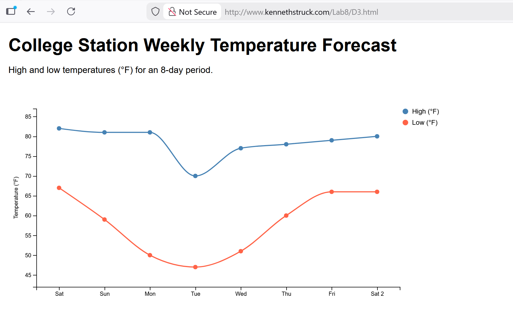
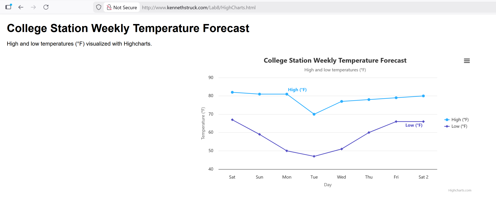
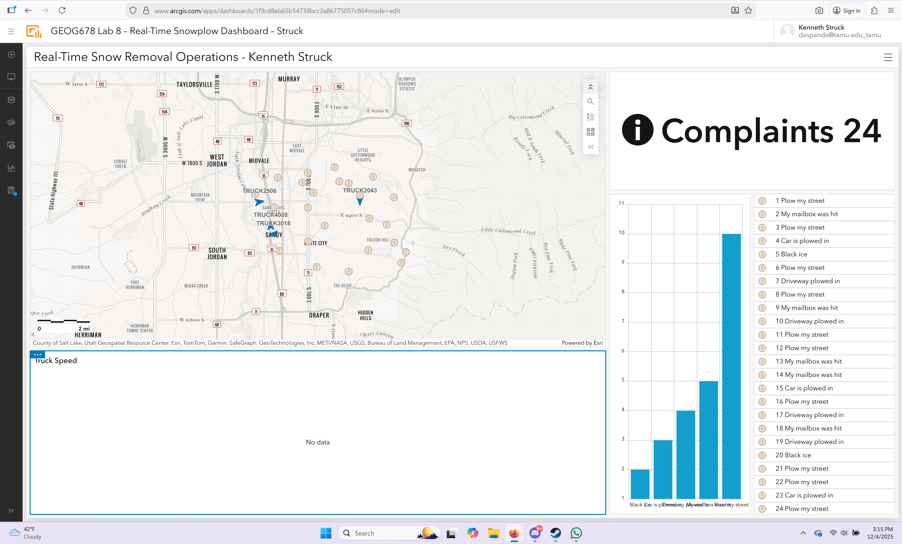

# GEOG 678 — Lab 08  
## Interactive Charts & Real-Time Dashboard  
Kenneth Struck  
Fall 2025

This lab demonstrates the creation of interactive web-based charts (D3.js and Highcharts) and a real-time dashboard using ArcGIS Dashboards.  
All required project files, HTML pages, and screenshots are included in this folder.

---

## 📌 **Part 1 — Web-Based Charts**

### **D3.js Line Chart**
**File:** [`D3.html`](./D3.html)  
**Screenshot:**  

This page visualizes an 8-day temperature forecast for College Station using a custom-built D3.js line chart with tooltips, legends, and styled axes.

---

### **Highcharts Line Chart**
**File:** [`HighCharts.html`](./HighCharts.html)  
**Screenshot:**  

This page reproduces the same temperature dataset using the Highcharts API, showing how library-based charting compares to a custom D3 implementation.

---

## 📌 **Part 2 — Real-Time Snowplow Dashboard**

### **Dashboard Link**
**ArcGIS Dashboard:**  
https://www.arcgis.com/apps/dashboards/1f9cd8eb65b54738bcc3a86775057c86

*(Note: Per instructor instructions, unavailable legacy layers such as Plows / Tracks / Street Plowed Status were skipped.)*

### **Dashboard Screenshot**

---

## ✔️ **Folder Contents (Summary)**

This `Lab_08` folder includes all required deliverables:

1. **D3.html** (D3.js chart)  
2. **HighCharts.html** (Highcharts chart)  
3. **DashboardScreenshot.png**  
4. **d3_screenshot.png**  
5. **highcharts_screenshot.png**  
6. **README.md** (this file)

All items have been uploaded according to lab instructions.

---

## ✅ **Lab Status**
All required components have been completed and documented.  
